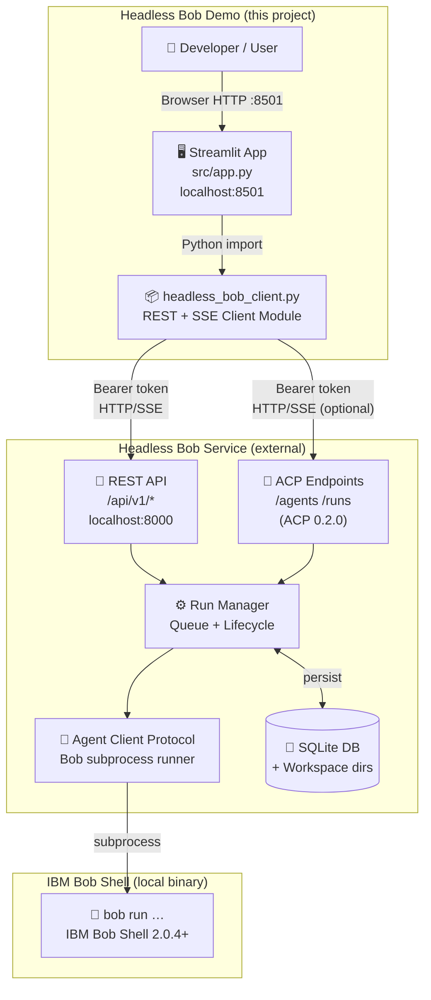
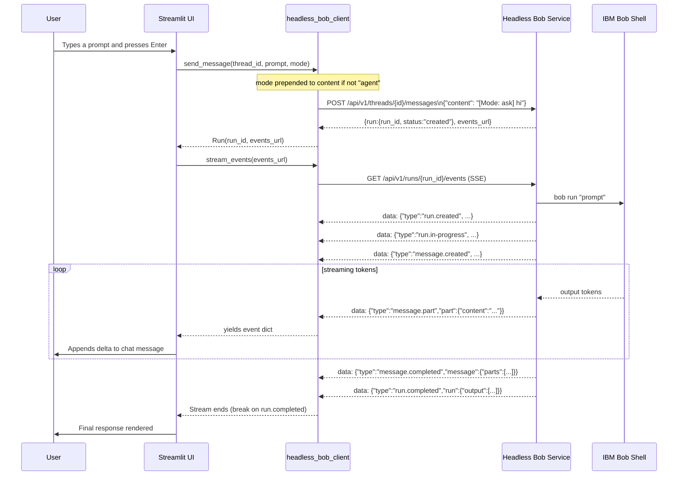
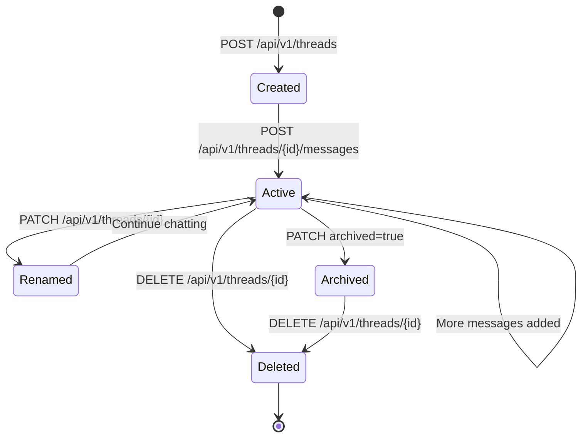

# Architecture — Headless Bob Demo

## Overview

This application demonstrates the **Headless Bob** integration pattern: wrapping IBM Bob Shell as a persistent HTTP service and driving it programmatically via REST and SSE.

---

## High-Level Architecture



---

## Component Descriptions

### `src/app.py` — Streamlit UI
The main entry point. Provides a chat-style browser interface for:
- Creating and managing conversation threads
- Sending prompts to Bob Shell
- Rendering Bob's streamed responses in real time
- Inspecting run metadata and downloading workspace files

### `src/headless_bob_client.py` — REST + SSE Client
A zero-dependency HTTP client (uses only Python's standard library `urllib`). Provides:
- `get_capabilities()` — server health and limits
- `create_thread()`, `list_threads()`, `rename_thread()`, `delete_thread()`
- `send_message()` — enqueues a Bob Shell run (**see API constraint note below**)
- `get_run()`, `cancel_run()` — run lifecycle management
- `stream_events()` — generator that consumes SSE from a run events URL
- `list_messages()` — conversation history for a thread
- `list_workspace_files()`, `download_workspace_file()` — workspace I/O

### Headless Bob Service (`/api/v1`)
The external service this application connects to. Defined by the [IBM Self-Serve Assets Building Blocks](https://github.com/ibm-self-serve-assets/building-blocks/tree/main/ai/ai-engineering/headless-bob) repository.

- **Thread isolation**: each thread has its own workspace directory; Bob can read and write files only within it.
- **Async execution**: runs are created immediately; the API returns a `run_id` and `events_url` without waiting for Bob to finish.
- **SSE streaming**: the `/events` endpoint streams typed JSON events as Bob works.

---

## API Constraints Discovered from the Live Service

### Message body is strictly `{"content": <string>}`

The `POST /api/v1/threads/{id}/messages` endpoint has `additionalProperties: false` in its
OpenAPI schema. **Any field other than `content` causes an immediate HTTP 400 Bad Request.**

This means a `mode` field cannot be passed in the request body. The workaround implemented
in `send_message()` is to prepend the mode as a natural-language prefix:

```python
# mode="ask"  →  content = "[Mode: ask] <original prompt>"
# mode="agent" (default)  →  content = "<original prompt>"  (no prefix added)
```

### Run ID lives inside `data["run"]["run_id"]`

The message POST response shape is:

```json
{
  "thread": { "id": "...", "status": "running", ... },
  "run":    { "run_id": "...", "status": "created", ... },
  "message_id": "...",
  "events_url": "/api/v1/runs/<run_id>/events"
}
```

The `run_id` must be read from `data["run"]["run_id"]`, not from a top-level `data["run_id"]`.

---

## Data Flow

### Sending a prompt and streaming the response



### Thread lifecycle



### Run status machine

The service uses these exact status strings (verified against the live SSE stream):

```mermaid
stateDiagram-v2
    [*] --> created: POST /messages enqueues run
    created --> in-progress: Bob Shell subprocess starts
    in-progress --> completed: Bob Shell exits successfully
    in-progress --> failed: Bob Shell exits with error
    in-progress --> cancelled: POST /runs/{id}/cancel
    completed --> [*]
    failed --> [*]
    cancelled --> [*]
```

---

## SSE Event Schema

The `/api/v1/runs/{id}/events` endpoint emits one JSON object per SSE `data:` line.
Each object has a `type` field. The full sequence for a successful run is:

| `type` | Key fields | When emitted |
|---|---|---|
| `run.created` | `run.run_id`, `run.status` | Immediately after run is accepted |
| `run.in-progress` | `run.status` | When Bob Shell subprocess starts |
| `message.created` | `message.role`, `message.parts` (empty) | Assistant message object initialised |
| `message.part` | `part.content_type`, `part.content` | Each streaming token from Bob |
| `message.completed` | `message.parts[]` | Full assembled message text |
| `run.completed` | `run.output[]`, `run.finished_at` | Run finished successfully — **stream ends** |
| `run.failed` | `run.error` | Run ended with an error — **stream ends** |

> **Note:** The old event names `result`, `message` (plain), `tool_use`, and `tool_result`
> do **not** appear in this service's SSE stream. Those names belong to the older
> Bob Shell `--format stream-json` CLI output format, which is a different interface.

### Example raw SSE frame (single `message.part` event)

```
id: 4
data: {"type":"message.part","part":{"content_type":"text/plain","content":"Hello!"}}

```

---

## Security Model

| Concern | Mitigation |
|---|---|
| Credentials in code | All secrets via `.env` / env vars; no hard-coded values |
| Token exposure in git | `.env` is gitignored; `.env.example` has only placeholders |
| Cross-thread file access | Headless Bob enforces per-thread workspace isolation |
| Token strength | `HEADLESS_BOB_TOKEN` must be ≥ 24 characters (service enforced) |
| HTTPS | Use a reverse proxy (nginx/Caddy) with TLS for production deployments |

---

## Environment Variables

| Variable | Required | Description |
|---|---|---|
| `HEADLESS_BOB_URL` | Yes | Base URL of the Headless Bob service, e.g. `http://127.0.0.1:8000` |
| `HEADLESS_BOB_TOKEN` | Yes | Bearer token matching one entry in `AUTH_TOKENS` in the service config |
| `BOB_API_KEY` | Service-side | IBM Bob Shell inference API key — set in the Headless Bob service `.env`, not in this demo directly |
