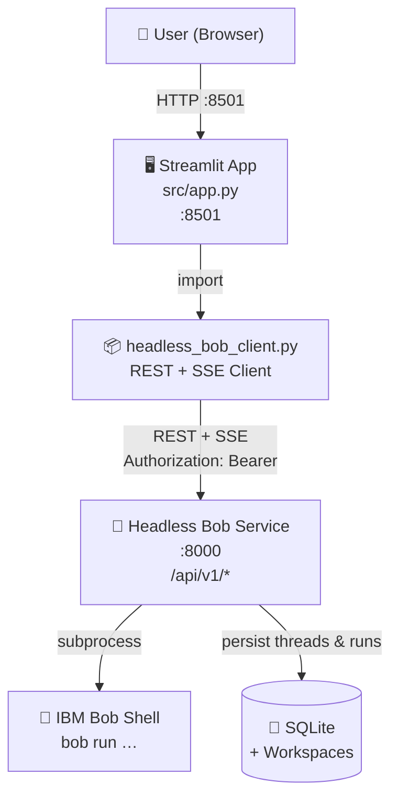

# Headless Bob Demo

A self-contained Python/Streamlit application that demonstrates and integrates the **Headless Bob** use-case from the [IBM Self-Serve Assets Building Blocks](https://github.com/ibm-self-serve-assets/building-blocks/tree/main/ai/ai-engineering/headless-bob) repository.

Headless Bob exposes IBM Bob Shell as a persistent HTTP service with thread-based conversations, asynchronous run execution, and real-time SSE streaming. This demo provides a browser UI to interact with that service and illustrates every core REST API operation.

---

## Architecture



---

## Why the Building Blocks Framework Was Necessary

### The problem IBM Bob Shell poses for programmatic use

IBM Bob Shell (`bob run`) is a powerful AI coding agent. In its native form it is a
**one-shot CLI process**: you invoke it with a prompt, it runs, it exits. That design
is intentional and correct for interactive terminal use, but it creates three hard
problems for any application that wants to drive Bob programmatically:

1. **No persistence.** Each `bob run` invocation is stateless. There is no built-in
   way to maintain a conversation across multiple calls, track which prompts were sent,
   or retrieve past responses. Every call starts from scratch.

2. **No concurrent multi-user access.** A plain `bob run` subprocess occupies the
   full Bob Shell process. If two clients try to run prompts at the same time, they
   collide. There is no queue, no isolation, and no way to safely share the binary
   between callers.

3. **No REST surface.** Bob Shell has no built-in HTTP server. Calling it from a
   Python application, a browser, a CI/CD pipeline, or any other system requires either
   wrapping it in a subprocess with brittle shell scripting, or having an HTTP layer
   that manages that subprocess reliably — including timeouts, errors, streaming
   output, and cleanup.

### What the Building Blocks `headlessbob` asset provides

The [Headless Bob asset](https://github.com/ibm-self-serve-assets/building-blocks/tree/main/ai/ai-engineering/headless-bob/assets/headlessbob)
in the IBM Self-Serve Assets Building Blocks repository solves all three problems by
wrapping Bob Shell in a production-quality Node.js service:

| Problem | What Headless Bob provides |
|---|---|
| No persistence | Thread-based conversation lifecycle backed by SQLite. Each thread has a unique ID, a full message history, and an isolated workspace directory on disk. |
| No concurrent access | A run queue with configurable concurrency limits (`MAX_CONCURRENT`, `MAX_QUEUED`). Runs are serialised safely; each caller gets its own workspace. |
| No REST surface | A fully-specified REST API (`/api/v1/*`) with OpenAPI documentation, Bearer-token authentication, structured JSON responses, and Server-Sent Events (SSE) streaming for live output. |

It also adds capabilities that would be extremely difficult to build from scratch:

- **SSE streaming** of Bob's output as it is generated, so a UI can show a live
  typing effect rather than waiting for the full response.
- **Run cancellation** (`POST /api/v1/runs/{id}/cancel`) to stop a long-running task.
- **Workspace file access** — Bob can write files during a run (e.g. generated code,
  reports), and those files are immediately downloadable via the REST API.
- **Agent Communication Protocol (ACP 0.2.0)** endpoints for multi-agent
  interoperability, alongside the REST API.
- **Bearer-token authentication** so the service can be safely exposed within a
  trusted network with per-caller identity.

### Why this demo could not have been built the same way without it

Without the Building Blocks `headlessbob` service, implementing equivalent functionality
in this demo would require:

1. **Subprocess management in Python** — launching `bob run` as a child process,
   reading its stdout/stderr, handling timeouts, and killing it on errors. This is
   fragile, platform-dependent, and requires the Bob Shell binary to be installed
   in the same environment as the Python app.

2. **Manual state storage** — inventing a database schema to store threads,
   messages, and run results, then building CRUD logic around it. The Building
   Blocks asset ships a complete, tested SQLite-backed store out of the box.

3. **Re-implementing SSE streaming** — `bob run --format stream-json` emits
   NDJSON on stdout, but piping that through a subprocess into a browser SSE
   connection requires a custom relay layer. The `headlessbob` service handles
   this entirely, exposing a clean `/runs/{id}/events` SSE endpoint.

4. **No concurrency or queuing** — running multiple prompts simultaneously from
   the Streamlit UI (e.g. across multiple browser tabs) would require building a
   task queue, which is a non-trivial engineering problem.

In short, the Building Blocks framework compresses weeks of infrastructure
engineering into a `npm ci && npm start`. This demo is then free to focus entirely
on demonstrating the integration pattern — thread management, prompt dispatch,
SSE streaming, workspace I/O — rather than on plumbing.

---

## What It Demonstrates

| Feature | REST Endpoint | Description |
|---|---|---|
| Server capabilities | `GET /api/v1/capabilities` | Shows service version, Bob version, limits |
| Thread lifecycle | `GET/POST /api/v1/threads` | Create, list, rename, delete conversation threads |
| Sending prompts | `POST /api/v1/threads/{id}/messages` | Enqueue a Bob Shell run for any task or question |
| Run status polling | `GET /api/v1/runs/{id}` | Fetch execution status, duration, token stats |
| Live SSE streaming | `GET /api/v1/runs/{id}/events` | Stream Bob's output token-by-token as it runs |
| Run cancellation | `POST /api/v1/runs/{id}/cancel` | Cancel an in-progress run |
| Workspace files | `GET /api/v1/threads/{id}/files` | Browse files Bob created inside the workspace |
| File download | `GET /api/v1/threads/{id}/files/download` | Download workspace-generated artifacts |

---

## Project Structure

```
headless-bob-demo/
├── src/
│   ├── app.py                  # Streamlit UI — main entry point
│   └── headless_bob_client.py  # REST + SSE client library
├── tests/
│   └── test_headless_bob_client.py   # Unit tests (offline, no service needed)
├── Docs/
│   ├── Quickstart.md           # Step-by-step setup guide
│   └── Architecture.md         # Detailed architecture and data flow
├── scripts/
│   ├── start.sh                # Start the Streamlit app in detached mode
│   ├── stop.sh                 # Gracefully stop the running app
│   └── cleanup.sh              # Remove venv, __pycache__, output contents
├── input/                      # Input documents (content gitignored)
├── output/                     # Timestamped outputs (content gitignored)
├── .bob/
│   └── artifacts/              # Bob artifacts for this project
├── .env.example                # Environment variable template
├── requirements.txt            # Python dependencies
└── README.md                   # This file
```

---

## Prerequisites

| Requirement | Notes |
|---|---|
| Python 3.11+ | Standard system Python or pyenv |
| Node.js 22+ | Required to run the Headless Bob service |
| IBM Bob Shell 2.0.4+ | Installed and on `PATH` — see [Installing Bob Shell](https://bob.ibm.com/docs/shell/getting-started/install-and-setup) |
| IBM Bob API key | Inference-scope key from https://bob.ibm.com — Account → API Keys |
| Headless Bob service | Running locally — see [Quick Start](#quick-start) below |

---

## Quick Start

### 1. Clone and enter the project

```bash
git clone <your-repo-url>
cd headless-bob-demo
```

### 2. Start the Headless Bob service

Clone the Building Blocks repo and start the service:

```bash
git clone https://github.com/ibm-self-serve-assets/building-blocks.git
cd building-blocks/ai/ai-engineering/headless-bob/assets/headlessbob
npm ci
cp .env.example .env
# Edit .env:
#   BOB_API_KEY=<your-bob-inference-api-key>
#   AUTH_TOKENS={"owner":"<your-chosen-bearer-token>"}
npm run build && npm start
# Service is now available at http://127.0.0.1:8000
```

> **Tip:** generate a strong bearer token with:
> `python3 -c "import secrets; print(secrets.token_urlsafe(32))"`

### 3. Configure the demo environment

```bash
cp .env.example .env
# Set these two values:
#   HEADLESS_BOB_URL=http://127.0.0.1:8000
#   HEADLESS_BOB_TOKEN=<same token as the value inside AUTH_TOKENS above>
```

### 4. Create a virtual environment and install dependencies

```bash
python3 -m venv .venv
source .venv/bin/activate
pip install -r requirements.txt
```

### 5. Run the application

```bash
./scripts/start.sh
# The app URL is printed to the console
```

Or manually:

```bash
streamlit run src/app.py --server.port 8501
```

Open **http://localhost:8501** in your browser.

---

## Using the Application

1. The sidebar shows the Headless Bob service status (connected / offline).
2. Click **➕ New** to create a conversation thread.
3. Select a Bob mode (agent / ask / plan) from the dropdown.
4. Type any task or question in the chat box and press Enter.
5. Bob's response streams in real time via SSE.
6. Expand **📊 Run details** to see token usage and duration.
7. If Bob created files in its workspace, they appear in **📁 Workspace files** — download them directly.

---

## Running Tests

```bash
source .venv/bin/activate
python -m pytest tests/ -v
```

All 31 tests run fully offline — no Headless Bob service or IBM credentials required.

---

## How the Headless Bob Integration Works

`src/headless_bob_client.py` is the core integration layer. It:

1. Reads `HEADLESS_BOB_URL` and `HEADLESS_BOB_TOKEN` from the environment.
2. Calls the REST API using Python's built-in `urllib` (no extra HTTP library needed).
3. Parses Server-Sent Events (SSE) from the `/api/v1/runs/{id}/events` endpoint to deliver streaming output to the UI.

The Streamlit frontend (`src/app.py`) uses the client to build a full chat experience:
- Thread creation → `POST /api/v1/threads`
- Prompt dispatch → `POST /api/v1/threads/{id}/messages`
- Live streaming → `GET /api/v1/runs/{id}/events` (SSE)
- File inspection → `GET /api/v1/threads/{id}/files`

### Key API behaviours to be aware of

**The message endpoint is strictly typed.**
`POST /api/v1/threads/{id}/messages` only accepts `{"content": <string>}`.
The schema has `additionalProperties: false`, so sending any other field (such as `mode`)
causes an immediate HTTP 400 Bad Request. The demo works around this by prepending the
selected mode as a natural-language prefix to the prompt text:

```
mode="ask"   →  "[Mode: ask] your prompt here"
mode="agent" →  "your prompt here"  (no prefix — agent is the default)
```

**SSE event names are service-specific.**
The Headless Bob SSE stream uses its own event type names. The key ones are:
`run.created` → `run.in-progress` → `message.part` (repeated) → `message.completed` → `run.completed`.
These are different from the `--format stream-json` CLI event names (`result`, `tool_use`, etc.).

**Run ID location in the response.**
`POST /messages` returns `{"run": {"run_id": "..."}, "events_url": "..."}`.
The `run_id` is nested inside the `run` object, not at the top level.

See [`Docs/Architecture.md`](Docs/Architecture.md) for full data-flow diagrams, the
complete SSE event schema, and the run status machine.

---

## Security

- **No credentials are hard-coded.** All secrets are loaded from `.env`.
- `.env` is gitignored. Only `.env.example` (with placeholder values) is committed.
- The Headless Bob client uses `Authorization: Bearer <token>` on every request.
- Workspace files are scoped per thread — Bob cannot access files from other threads.

---

## License

This project is released under the **Apache License 2.0**.

```
Copyright 2024 IBM Corporation

Licensed under the Apache License, Version 2.0 (the "License");
you may not use this file except in compliance with the License.
You may obtain a copy of the License at

    http://www.apache.org/licenses/LICENSE-2.0

Unless required by applicable law or agreed to in writing, software
distributed under the License is distributed on an "AS IS" BASIS,
WITHOUT WARRANTIES OR CONDITIONS OF ANY KIND, either express or implied.
See the License for the specific language governing permissions and
limitations under the License.
```
